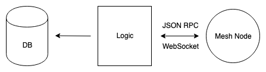

# How to keep an external database in-sync with a Mesh node

This guide will walk you through syncing an external database with a Mesh node so that the external database's state mirrors that of the Mesh node (and vice-versa). Whenever new orders are discovered or added to Mesh, they are inserted into the database. If an order is filled, cancelled, or has its fillability changed it is updated or removed from the database. We are assuming that your database is storing both the order itself and the remaining fillable amount (i.e., its `fillableTakerAssetAmount`).

## High-level architecture

Mesh is a stand-alone daemon that will be running independently from the rest of your infrastructure. Your backend will communicate with the Mesh node over [WebSockets](https://en.wikipedia.org/wiki/WebSocket) using [JSON-RPC](https://www.jsonrpc.org/). This is a bi-directional connection allowing both your server to notify Mesh of new orders, and Mesh to notify your server of order updates.

## Initial sync

When first connecting the DB and Mesh node, we first need to make sure both have the same orders and order-relevant state stored. We do this with the following steps:

#### 1. Subscribe to Mesh

Subscribe to the Mesh node's `orders` subscription over a WS connection. This can be done using our [golang](https://godoc.org/github.com/0xProject/0x-mesh/rpc) or [Typescript/Javascript](./json_rpc_clients/typescript/README.md) clients or any other JSON-RPC WebSocket client. Whenever you receive an order event from this subscription, make the appropriate updates to your DB. Each order event has an associated [OrderEventKind](https://godoc.org/github.com/0xProject/0x-mesh/zeroex#pkg-constants).

| Kind                                       | DB operation                    |
|--------------------------------------------|---------------------------------|
| ADDED                                      | Insert                    |
| FILLED                                     | Update |
| FULLY_FILLED, EXPIRED, CANCELLED, UNFUNDED | Remove                    |
| FILLABILITY_INCREASED                      | Upsert             |

**Note:** Updates refer to updating the order's `fillableTakerAssetAmount` in the DB.

#### 2. Get all orders currently stored in Mesh

There might have been orders stored in Mesh that the DB doesn't know about at this time. Because of this, we must fetch all currently stored orders in the Mesh node and upsert them in the database. This can be done using the [mesh_getOrders](./rpc_api.md#mesh_getorders) JSON-RPC method. This method creates a snapshot of the Mesh node's internal DB of orders when first called, and allows for subsequent paginated requests against this snapshot. Because we are already subscribed to order events, any new orders added/removed after the snapshot is made will be discovered via that subscription.

**Note:** The [Mesh Typescript client](./json-rpc-clients/typescript) has a convenience method that does the multiple paginated requests for you under-the-hood. You can simply call the [getOrders](./json-rpc-clients/typescript/classes/_ws_client_.wsclient#getordersasync) method.

#### 3. Add all database orders to the Mesh node

Since there might also be orders added to the database that Mesh doesn't know about, we must also add all DB orders to Mesh. We can do this using the [mesh_addOrders](./rpc_api.md#mesh_addorders) JSON-RPC method. This method accepts an array of signed 0x orders and returns which have been accepted and rejected. The accepted orders are returned with their `fillableTakerAssetAmount` and so these amounts should be updated in the database. Rejected orders are rejected with a specific [RejectedOrderStatus](https://godoc.org/github.com/0xProject/0x-mesh/zeroex#pkg-variables), including an identifying `code`.

| Code                                                                                                                                                                                                                  | Reason                        | Should be retried? |
|-----------------------------------------------------------------------------------------------------------------------------------------------------------------------------------------------------------------------|-------------------------------|--------------------|
| EthRPCRequestFailed, CoordinatorRequestFailed, CoordinatorEndpointNotFound, InternalError                                                                                                                             | Failure to validate the order     | Yes                |
| MaxOrderSizeExceeded, OrderMaxExpirationExceeded, OrderForIncorrectNetwork, SenderAddressNotAllowed                                                                                                                   | Failed Mesh-specific criteria | No                 |
| OrderHasInvalidMakerAssetData, OrderHasInvalidTakerAssetData, OrderHasInvalidSignature, OrderUnfunded, OrderCancelled, OrderFullyFilled, OrderHasInvalidMakerAssetAmount, OrderHasInvalidTakerAssetAmount, OrderExpired | Invalid or unfillable order   | No                 |

If an order was rejected with a code related to the "failure to validate the order" reason above, you can re-try adding the order to Mesh after a back-off period. For all other rejection reasons, the orders should be removed from the database.

#### 4. Handle dropped connections

After performing the first 3 steps above, the Mesh node and database will be in-sync, and continue to remain in-sync thanks to the active order event subscription. If any new orders are added to the database, they will also need to be added to Mesh of course. But what if the WebSocket connection to the Mesh node goes down? In that case, it must be re-established and steps 1, 2 & 3 must be performed once again.

**Note:** The [Mesh Typescript client](./json-rpc-clients/typescript/classes/_ws_client_.wsclient#getordersasync) takes care of re-connecting and re-establishing _all_ active subscriptions once it detects a disconnection. You can subscribe to a `reconnected` event using the [onReconnected](./json-rpc-clients/typescript/classes/_ws_client_.wsclient#onreconnected) method. Whenever this callback is fired is when you need to re-run steps 2 and 3.

**Note 2:** With some WebSocket clients, we've noticed that the client is not always aware of when the connection has been dropped. It can be hard for clients to discern between a network disruption and latency. Because of this, we added an explicit [heartbeat subscription](./rpc_api.md#mesh_subscribe-to-heartbeat-topic) to Mesh that you can subscribe to. If a heartbeat isn't received after some interval (e.g., 20 seconds), the client can forcible drop the connection and re-establish a new one. This too is already taken care of under-the-hood for those using the [Mesh Typescript client](./json-rpc-clients/typescript/classes/_ws_client_.wsclient#getordersasync).

Happy database syncing!
